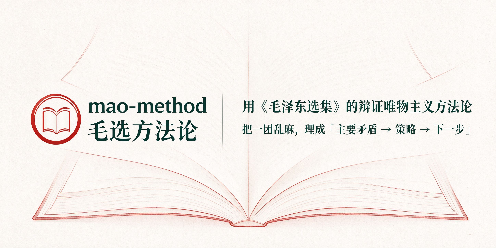

# mao-method



> 用《毛泽东选集》的辩证唯物主义方法论，把一团乱麻的问题理成「**主要矛盾 → 策略 → 下一步**」。

不是鸡汤生成器，是一个可复现的判断框架。你带着一团乱麻进来，带着「现状、主要矛盾、策略、下一步」出去。

## 它解决什么问题

| 模式 | 解决的问题 | 典型一句话 |
| --- | --- | --- |
| **A 决策诊断** | 看不清局势、抓不住重点、不知道该先干什么 | "好几件事同时在，不知道先做哪个" |
| **B 战略推进** | 长期目标反复推不动、方向反复变 | "做了很久没起色，要不要换方向" |
| **C 说服沟通** | 需要动员、谈判、说服、影响他人 | "道理讲了很多，对方就是不听" |

**它不解决**：一句话的事实问答、无需抓重点的简单咨询、纯数据查询、政治立场或历史评价。

## 安装

```bash
npx -y skills add Rosa168/mao-method -g --all
```

安装后 skill 会链接到 `~/.agents/skills/mao-method`，本机已安装的其他 Agent 客户端也会同步建立入口。

## 怎么分享 / 让别人安装

把下面这一行发给对方即可。支持 skill 安装的 AI 客户端（豆包桌面版、Claude Code、Codex 等）会自动执行安装：

```bash
npx -y skills add Rosa168/mao-method -g --all
```

**如果对方是普通网页版 AI / 不会执行命令**：让对方在自己电脑的「终端 / 命令提示符」里粘贴上面这行并回车，看到提示 `Installed 1 skill` 即装好。

给对方的一句现成话术：

```text
帮我安装一个 skill（毛选分析）。在命令行里运行：

npx -y skills add Rosa168/mao-method -g --all

装好后，我说"用毛选分析 skill"就能用了。
```

## 怎么用

**方式一（推荐）**：直接说你的处境，助手会自动判定属于 A / B / C 哪种模式。

**方式二（点名模式）**：

```
用毛选方法帮我做决策
用毛选方法帮我分析这个长期目标
用毛选方法帮我说服某个人
```

### 输出长什么样

每次都是一份固定结构的报告：

```
事实还原（实事求是）
  → 主要矛盾（抓主要矛盾）
  → 矛盾的两个方面（两点论）
  → 策略（具体问题具体分析）
  → 具体下一步（第一个动作）
  → 一句话处方
```

有结构关系时还会配一张可视化图（主要矛盾判断框架图 / 阶段复盘流程图 / 群众路线关系图）。

### 例子

- 「我有三四个方向都想做，感觉都有机会，但精力有限，不知道先干哪个。」
- 「做自媒体三个月，粉丝没涨多少，想换个赛道。」
- 「我觉得应该转做 A 方向，但团队里很多人反对，觉得风险大。」

## 目录结构

```
skills/mao-method/
├── SKILL.md                    主入口：公理 + 模式选择 + 报告模板 + 边界
├── agents/openai.yaml          UI 元数据
└── references/
    ├── usage-guide.md          使用指南（首次触发时展示）
    ├── mode-decision.md        模式 A 详细流程
    ├── mode-strategy.md        模式 B 详细流程
    └── mode-persuasion.md      模式 C 详细流程
```

**仓库还附带视觉资源**（在 `assets/` 目录）：

- `assets/mao-method-cover.png`：仓库封面横幅（README 顶部那张）
- `assets/mao-method-logo.png`：标志图
- `assets/usage-guide.html`：使用指南信息图，浏览器直接打开即可查看（含三模式路由、8 步工作流、可视化图与边界）

## 六条公理

每条都对应一个具体的判断动作，不做装饰：

| 公理 | 对应的判断动作 |
| --- | --- |
| 实事求是 | 还原事实，把「事实 / 判断 / 情绪」分开，只用事实下结论 |
| 矛盾分析 | 多问题并存时，找出解决后其他会连锁松动的那一个 |
| 调查研究 | 重大判断前先收集第一手事实，不用二手印象 |
| 实践—认识—再实践 | 先干起来拿反馈，再修正认识，不靠空想 |
| 具体问题具体分析 | 同一方法在不同时间/地点/条件下结论不同，不套模板 |
| 群众路线 | 面向人的判断，先了解对方的真实处境和利益 |

## 依赖

**没有依赖。** 纯 Markdown，不含任何脚本，不联网，不需要 API key。

## 边界

- 只做方法论分析，**不评论政治立场、不评价历史人物功过、不介入政治性争议**。
- 不编造数据——分析只基于你提供的真实信息；信息不足时标注「此结论基于不完整信息」。
- 涉及重大决策（投资、法律、健康、人身）时，会提醒咨询相应专业人士。
- 说服模式遇到诱导、欺骗、操纵时立即停止——说服是讲清利益与事实，不是操控。

## 许可

[MIT License](LICENSE)。可自由使用、修改、分发，保留署名即可。

## 关于

作者：**Rosa** · 公众号「Rosa的成长笔记」

制作复盘：《从"为什么不做"到"为什么看不清"——把《毛选》做成一个 AI skill 的思考与制作复盘》
<https://mp.weixin.qq.com/s/dCgp244STYeV2-0-8EYJFQ>

制作流程遵循 [dbs-skill-maker](https://github.com/dontbesilent2025/dbskill) 的「问题契约 → 行为契约 → 选机制 → 生成候选 → 分级验证」五步工序。
